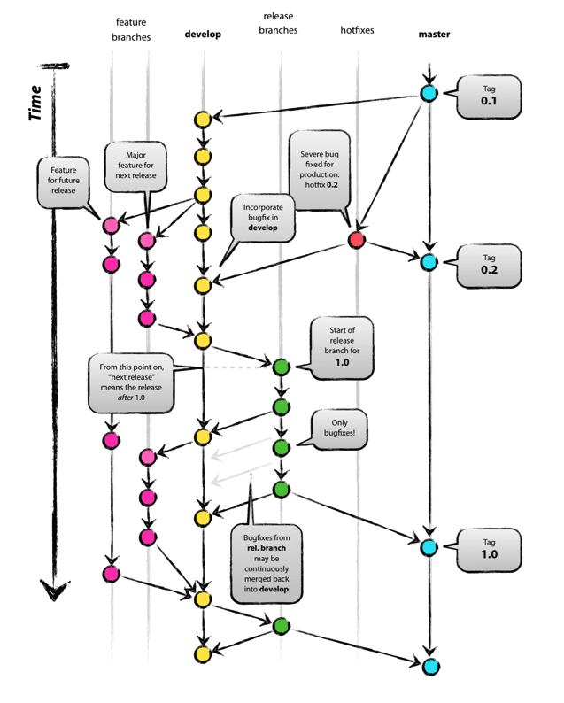

 [Github-Rules](./Github-Rules.md) 를 작성하다 git-flow 전략이 있어 참고하려고 가져왔다.

Github-Rules에서는 9개의 브랜치가 존재했는데, 줄여볼까 한다.

항상 유지되는 메인 브랜치(master, develop, docs)과 일정 기간 동안만 유지되는 보조 브랜치 feature, release, hotfix)로 변경할 예정이다.

git-flow 와 차이는 docs 브랜치가 메인 브랜치로 들어간다는 것이다.

이번 프로젝트는 기록도 중요하다 생각되어 docs 브랜치를 따로 메인 브랜치로 두어 문서를 관리할까 한다.

예를 들어 feature 브랜치로 기능을 구현하면서 커밋을 하고, 하나의 기능 구현이 완성 되면 develop으로 스쿼시 커밋을 해서 묶는다. develop에서 봤을 땐 하나의 기능의 추가만 보이게 된다.

docs도 마찬가지로 작성중인 문서는 보조 브랜치로 작서을 하고, 작성이 완료되면 docs 브랜치에 스쿼시 커밋을 해준다. docs 브랜치는 완성된 문서의 commit 만 보이게 한다.

