# 배모(배달할 사람 다 모여)

## 배포 링크 : [http://www.dobbyteam.com](http://www.dobbyteam.com:3000/)

## 작동 영상 : [링크](https://www.youtube.com/watch?v=JGtewURwX1c)

## **배달앱의 배달비와 최소 주문금액으로 인한 과소비 해결을 위한 < "배달비 쉐어 서비스" >**

배달앱의 가장 큰 단점인 과한 배달비와 최소 주문금액을 해결할 수 있도록 하는 서비스로 기존 앱과는 달리 채팅을 이용한 같이 주문하는 방식으로 배달을 자주 이용하는 1인 가구, 대학생 등 배달비에 부담을 느끼고 있는 사람들을 위해 이웃과 함께 배달료를 더치페이하는 공동구매 및 채팅 서비스

## 프로젝트를 진행하기 전에 팀원들과의 약속들

[GitHub 규칙](./Document/Github-Rules.md)

[API 명세](./Document/HTTP-API-명세.md) 및 [swagger](http://34.195.94.5:2999/swagger-ui/index.html#/)

## 프로그램 순서도

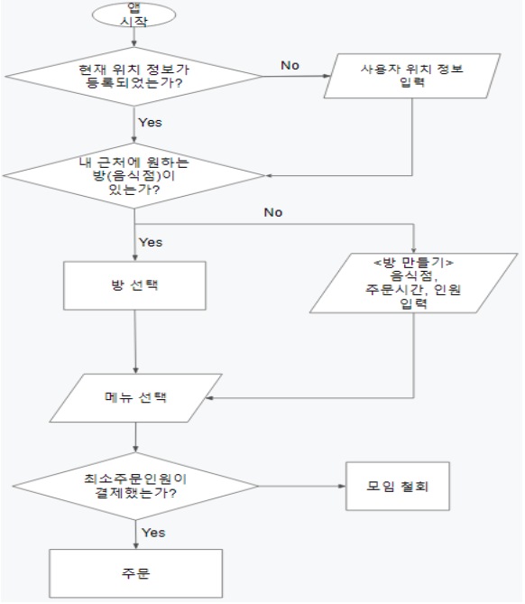

## 프로그램 시연

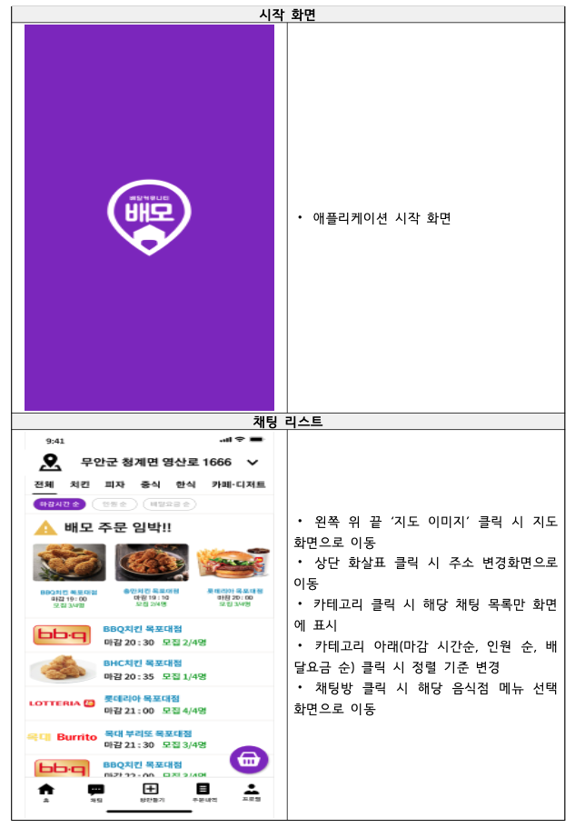

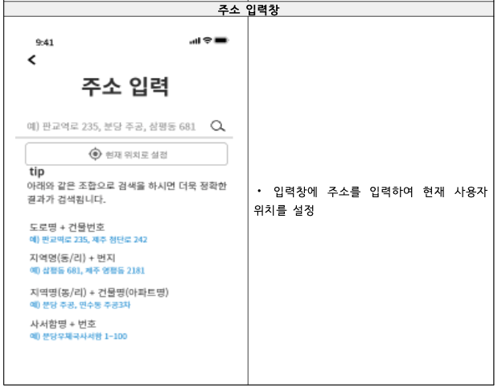

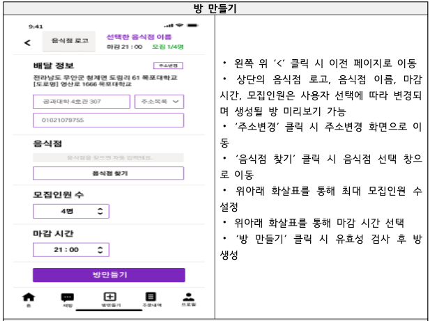

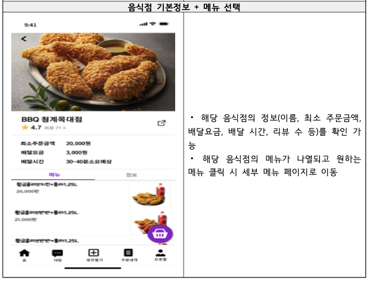

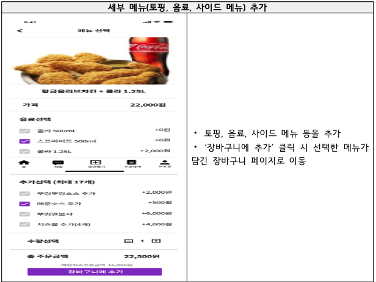

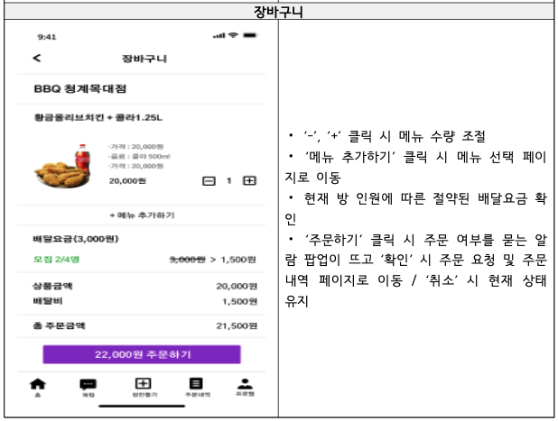

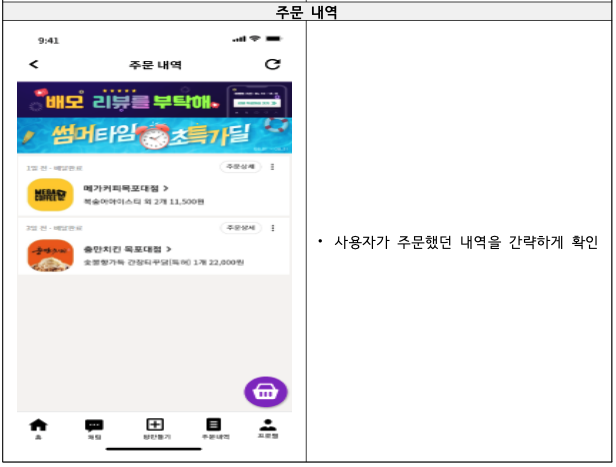

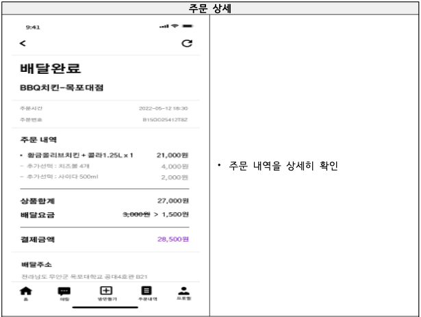

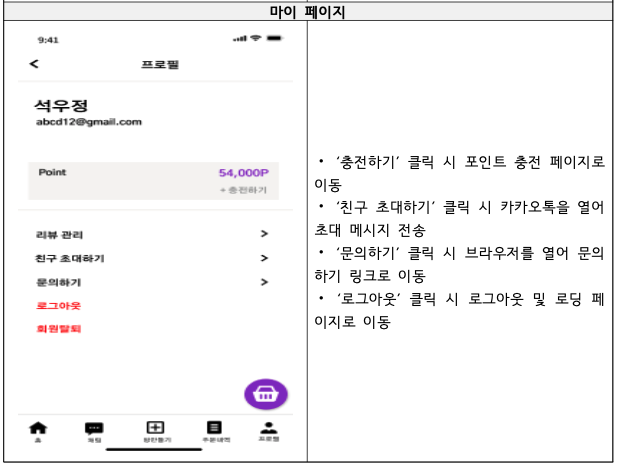

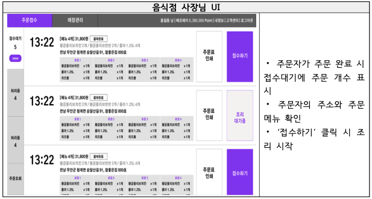

## 시스템 구성 및 개발 환경

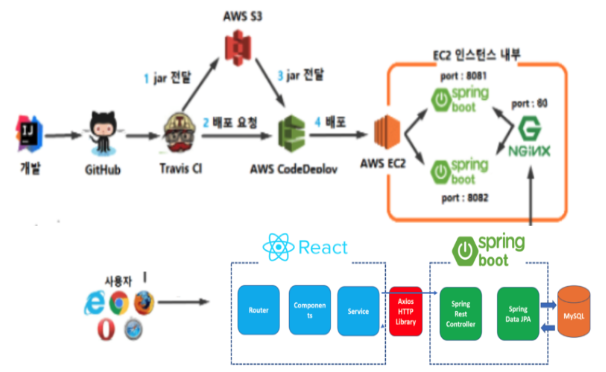

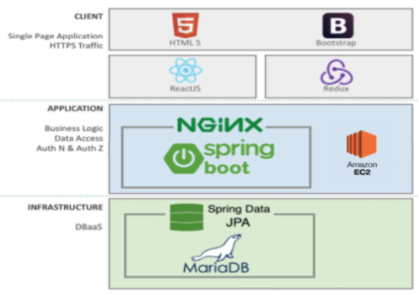

## DB

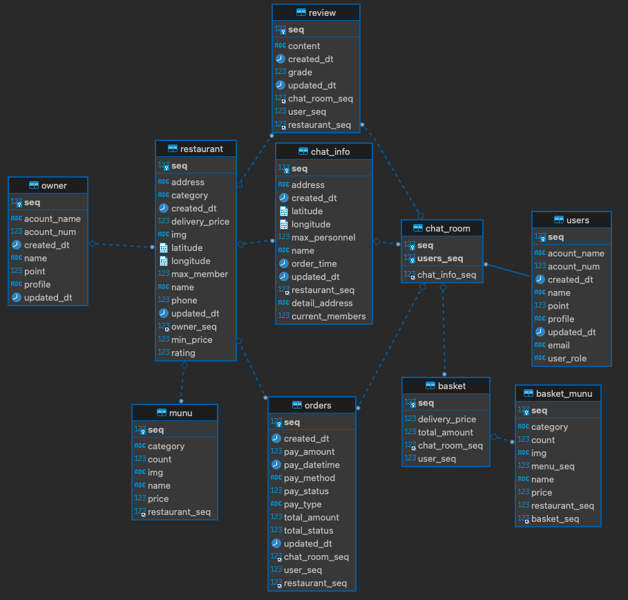

